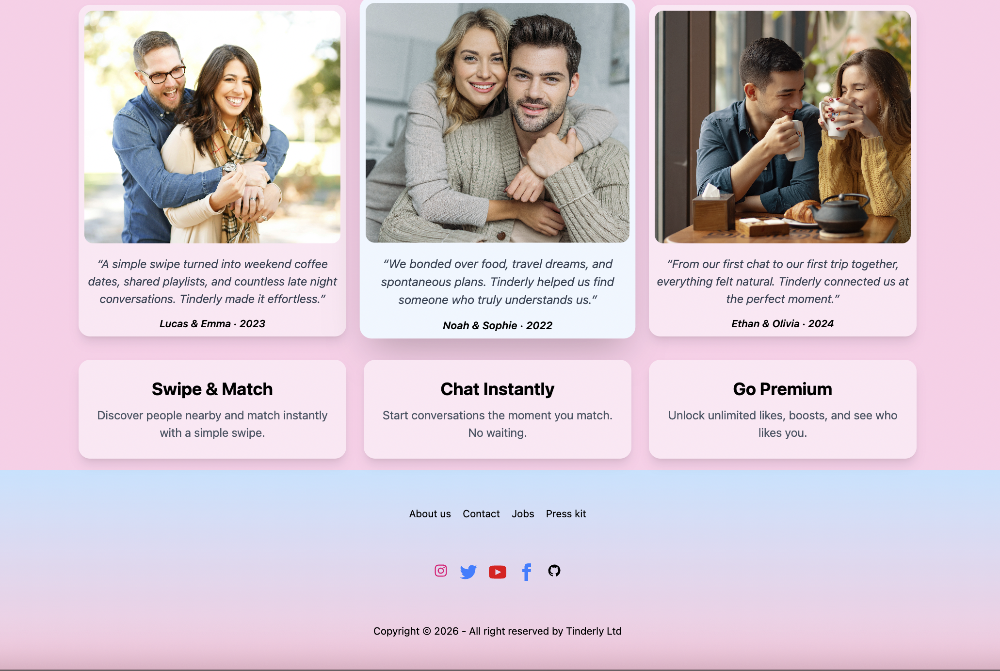
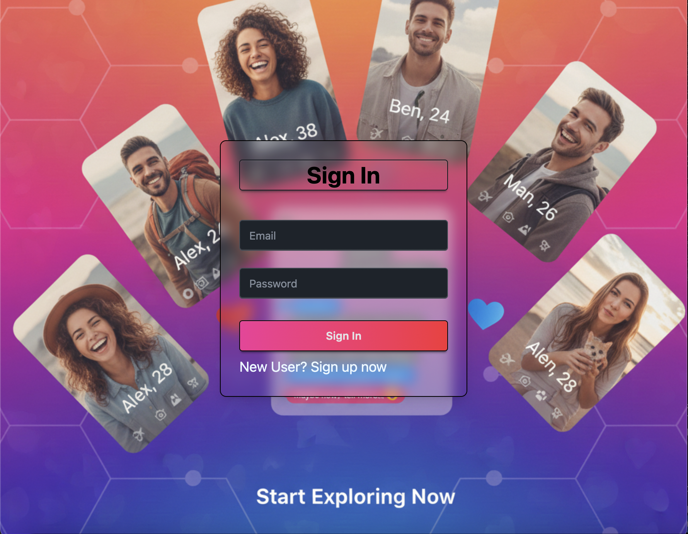
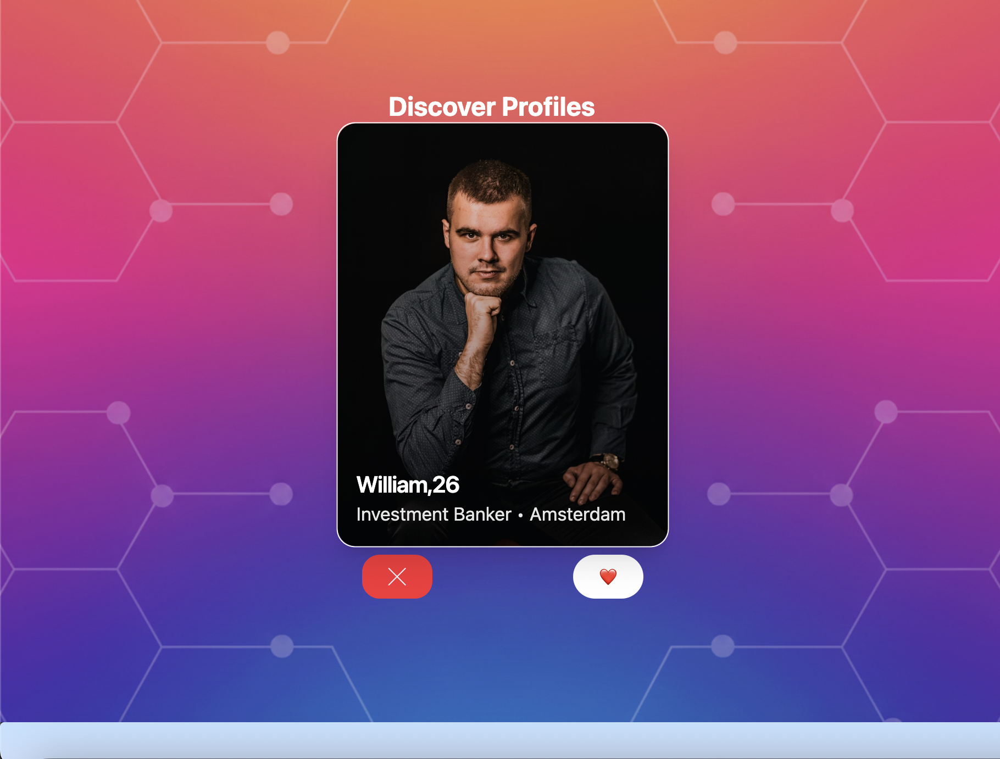
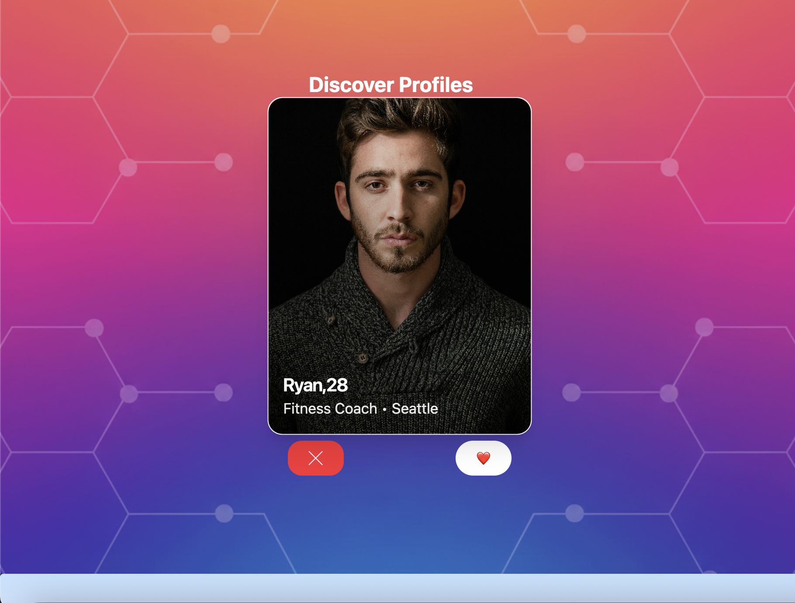

# Tinderly

Tinderly is a frontend web application built with React and Vite that provides a modern dating style profile discovery experience.

It offers a Tinder inspired swipe style interface where users can sign up or sign in using Firebase Authentication, access protected Feed and Profile pages, discover profiles in a smooth animated card feed, interact using accept and reject actions, and update their details through a Profile Settings form, with session state managed using Redux and the UI styled using Tailwind CSS.

### Home Page UI




### Login Page UI



### Feed Page UI





## Key Features

1. User Authentication & Session Handling.

2. Profile Feed Browsing & Interaction.

3. Dynamic Profile Rendering

4. Profile Editing & State Persistence

5. Global State Management & UI Synchronization

## Project Structure

- `src/` : contains all app components and routing.

- `src/utils/` : contains Firebase setup, validation logic, profile data and Redux slices.
- `public/`: holds static assets (images and icons)
- `root` : contains .env to store secrets,
  firebase config and vite config files and other files.

## Getting Started 

### Prerequisites

- Node.js 18+ (recommended)
- npm 9+ (or a compatible package manager)

### Setup

1. Install dependencies:

   ```bash
   npm install
   ```

2. Create a `.env` file with your Firebase config:

   ```
   VITE_FIREBASE_API_KEY=...
   VITE_FIREBASE_AUTH_DOMAIN=...
   VITE_FIREBASE_PROJECT_ID=...
   VITE_FIREBASE_STORAGE_BUCKET=...
   VITE_FIREBASE_MESSAGING_SENDER_ID=...
   VITE_FIREBASE_APP_ID=...
   VITE_FIREBASE_MEASUREMENT_ID=...
   ```

3. Run the app:

   ```
   npm run dev
   ```

4. Build for production:
   ```bash
   npm run build
   ```

## Deployment on Firebase

The application is deployed using Firebase Hosting, which serves the optimized production build generated by Vite. Check now https://tinderly-f55a9.firebaseapp.com/

Key deployment steps:

- Build the project using command: npm run build

- Deploy the generated dist/ folder to Firebase Hosting

- Configure Firebase rewrites to support client side routing

## Tech Stack

- Frontend Framework: React  
- Build Tool: Vite  
- Styling: Tailwind CSS  
- Language: JavaScript (ES6+)  
- State Management: Redux Toolkit (RTK)  
- Deployment: Firebase Hosting

## Contribution

All Contributions are welcomed.

1. Fork the repo and create your branch: `git checkout -b feature/my-feature`
2. Commit changes: `git commit -m "Add my feature"`
3. Push to your branch: `git push origin feature/my-feature`
4. Open a Pull Request

## Author

- Built By Prabhjot Singh
- Feel free to explore, fork or contribute.
